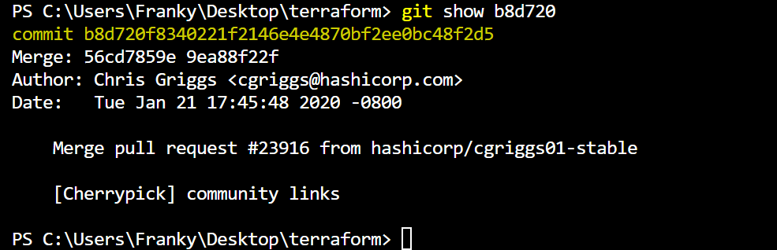

Задание В клонированном репозитории:
Найдите полный хеш и комментарий коммита, хеш которого начинается на aefea. 
Ответьте на вопросы. Какому тегу соответствует коммит 85024d3? Сколько родителей у коммита b8d720? 
Напишите их хеши. 
Перечислите хеши и комментарии всех коммитов, которые были сделаны между тегами v0.12.23 и v0.12.24. 
Найдите коммит, в котором была создана функция func providerSource, её определение в коде выглядит так: func providerSource(...) (вместо троеточия перечислены аргументы). 
Найдите все коммиты, в которых была изменена функция globalPluginDirs. 
Кто автор функции synchronizedWriters? В качестве решения ответьте на вопросы и опишите, как были получены эти ответы

Решение:

два родителя: 56cd7859e0 9ea88f22fc

Хеши и комментарии всех коммитов между тегами v0.12.23 и v0.12.24

коммит, в котором была создана функция func providerSource

коммиты, в которых была изменена функция globalPluginDirs

автор функции synchronizedWriters James Bardin

